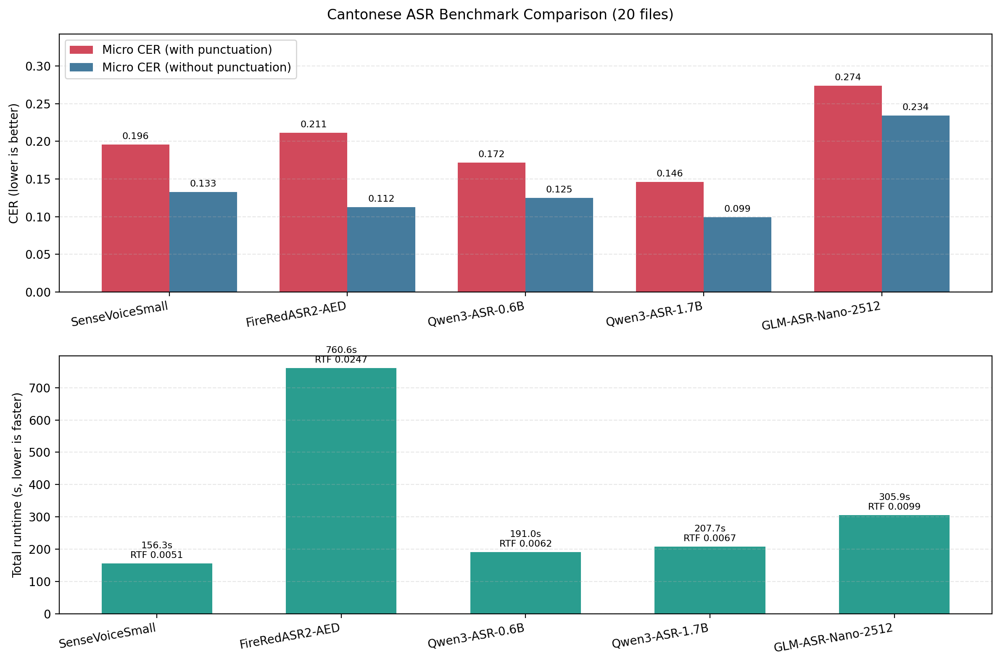

# 粵語 ASR 模型橫向評測

目前（2026 上半年）市面上有以下號稱最準嘅粵語語音識別模型：

- [FunAudioLLM/SenseVoiceSmall](https://huggingface.co/FunAudioLLM/SenseVoiceSmall)
- [FireRedTeam/FireRedASR2-AED](https://huggingface.co/FireRedTeam/FireRedASR2-AED)
- [Qwen/Qwen3-ASR-0.6B](https://huggingface.co/Qwen/Qwen3-ASR-0.6B)
- [Qwen/Qwen3-ASR-1.7B](https://huggingface.co/Qwen/Qwen3-ASR-1.7B)
- [zai-org/GLM-ASR-Nano-2512](https://huggingface.co/zai-org/GLM-ASR-Nano-2512)

本倉庫採用張悦楷講古語音數據集 [CanCLID/zoengjyutgaai](https://huggingface.co/datasets/CanCLID/zoengjyutgaai) 中每部作品（《三國演義》、《水滸傳》、《走進毛澤東的最後歲月》、《鹿鼎記》）嘅前 5 集，共 20 集作為測試數據，評測每隻模型嘅CER。

## Folder convention

- `input/`: input audio files (`.opus`, `.wav`, `.mp3`, etc.)
- `reference/`: golden SRT with matching stem names
- `predicted/`: generated outputs (default)

Example:

- `input/001.opus`
- `reference/001.srt`

## 點開始評測

確保已經安裝 

- [uv](https://docs.astral.sh/uv/getting-started/installation/)
- [ffmpeg](https://ffmpeg.org/download.html)
- [NVIDIA driver](https://www.nvidia.com/en-us/drivers/)

然後跑：

```bash
# 安裝依賴
uv venv
uv pip install -r requirements.txt
# 開始評測
uv run python scripts/sensevoice_srt_cer.py --output-dir predicted/sensevoicesmall
uv run python scripts/fireredasr2_aed_srt_cer.py --output-dir predicted/fireredasr2
uv run python scripts/qwen3_asr_srt_cer.py --output-dir predicted/qwen3asr_0_6b
uv run python scripts/qwen3_asr_1_7b_srt_cer.py --output-dir predicted/qwen3asr_1_7b
uv run python scripts/glm_asr_nano_2512_srt_cer.py --output-dir predicted/glmasr
```

如果想跑單個文件：

```bash
uv run python scripts/sensevoice_srt_cer.py \
  --audio input/001.opus \
  --golden-srt reference/001.srt \
  --output-srt predicted/sensevoicesmall/001.sensevoice.srt
```

Notes:

- First run downloads models from Hugging Face / ModelScope and may clone model source repos to `.cache/`.
- Device defaults to `auto` (uses `cuda:0` if available, otherwise `cpu`).
- `Qwen3-ASR` scripts should use `transformers==4.57.6` (same as upstream `qwen-asr` pin).
- Using newer `transformers` versions for Qwen may cause decode failure / repetitive hallucination outputs.
- `GLM-ASR-Nano-2512` currently needs `transformers` from GitHub source.
- Qwen and GLM have conflicting `transformers` requirements; run them in separate virtual environments.

輸出結果都喺

- `<output-dir>/<stem>.<model>.srt`
- `<output-dir>/<stem>.<model>.analysis.md` (error analysis report)

模型總結

- `<summary-dir>/<summary-name>.md` (default: `summary/<model>.md`)
- 可以用 `--summary-dir` 同 `--summary-name` 覆蓋預設位置同檔名。

## 指標

- `CER（含標點符號）`
- `CER（唔含標點符號）`
- `Micro CER`: 所有音頻加埋嘅 CER (`sum(edit_distance) / sum(reference_chars)`)
- `Macro CER`: 單個音頻文件 CER 嘅平均數（唔同長度嘅音頻都相同權重）
- `Total runtime (s)` (batch wall-clock for evaluated files)
- `End-to-end RTF` (`runtime / audio_duration`, lower is faster)

Benchmark setup note:

- All benchmark scripts default to `fsmn-vad` (FunASR/ModelScope).
- All benchmark scripts use the same default max VAD segment length: `10s` (`--vad-max-segment-ms=10000`).
- `scripts/fireredasr2_aed_srt_cer.py` and `scripts/qwen3_asr_1_7b_srt_cer.py` support VAD ablation via `--vad-backend {fsmn,firered}`.

## 評測結果

20 集數據

| Model                         |  Micro CER | Micro CER (No Punc) |  Macro CER | Macro CER (No Punc) | Total Runtime (s) | End-to-end RTF | Summary                                         |
| ----------------------------- | ---------: | ------------------: | ---------: | ------------------: | ----------------: | -------------: | ----------------------------------------------- |
| `FunAudioLLM/SenseVoiceSmall` | `0.195603` |          `0.132843` | `0.191163` |          `0.129152` |         `156.283` |     `0.005069` | `summary/sensevoicesmall.md`                    |
| `FireRedTeam/FireRedASR2-AED` | `0.211381` |          `0.112433` | `0.207529` |          `0.108727` |         `760.629` |     `0.024670` | `summary/fireredasr2_aed.md`                    |
| `Qwen/Qwen3-ASR-0.6B`         | `0.171614` |          `0.124986` | `0.168179` |          `0.122061` |         `191.023` |     `0.006196` | `summary/qwen3_asr_0_6b.md`                     |
| `Qwen/Qwen3-ASR-1.7B`         | `0.146337` |          `0.099373` | `0.143441` |          `0.096971` |         `207.735` |     `0.006738` | `summary/qwen3_asr_1_7b.md`                     |
| `zai-org/GLM-ASR-Nano-2512`   | `0.273824` |          `0.234102` | `0.270719` |          `0.231555` |         `305.891` |     `0.009921` | `summary/glm_asr_nano_2512.md`                  |



## Qwen3-ASR-1.7B VAD 對比測試

用相同嘅20集，同樣係 Qwen3-ASR-1.7B，對比 fsmn-vad 同 FireRedVAD

| Setup                              |  Micro CER | Micro CER (No Punc) |  Macro CER | Macro CER (No Punc) | Total Runtime (s) | End-to-end RTF | Summary                                                       |
| ---------------------------------- | ---------: | ------------------: | ---------: | ------------------: | ----------------: | -------------: | ------------------------------------------------------------- |
| `Qwen3-ASR-1.7B + fsmn-vad`        | `0.950246` |          `0.979746` | `0.951240` |          `0.981107` |         `535.070` |     `0.017354` | `summary/qwen3_asr_1_7b_cmp_fsmn.md`                         |
| `Qwen3-ASR-1.7B + FireRedVAD`      | `1.179558` |          `1.247898` | `1.179459` |          `1.248451` |         `592.206` |     `0.019208` | `summary/qwen3_asr_1_7b_cmp_fireredvad.md`                   |

- In this ablation, `fsmn-vad` is better than `FireRedVAD` for Qwen 1.7B (lower CER and faster runtime).
- Treat this table as a VAD backend A/B result (relative comparison between two backends under the same run conditions).
- To keep both ablation summaries, run with `--summary-name qwen3_asr_1_7b_cmp_fsmn` and `--summary-name qwen3_asr_1_7b_cmp_fireredvad`.

## Current optimizations

- Auto device selection (`cuda:0` first, then CPU fallback)
- VAD segmentation enabled with default max segment length `10s`
- Batched segment inference for ASR (`--segment-batch-size`, auto-tuned by device)
- Cantonese post-processing with OpenCC `s2hk` and custom regex corrections
- Detailed markdown analysis with top substitutions/deletions/insertions, mismatch examples, and aggregated error patterns across files
